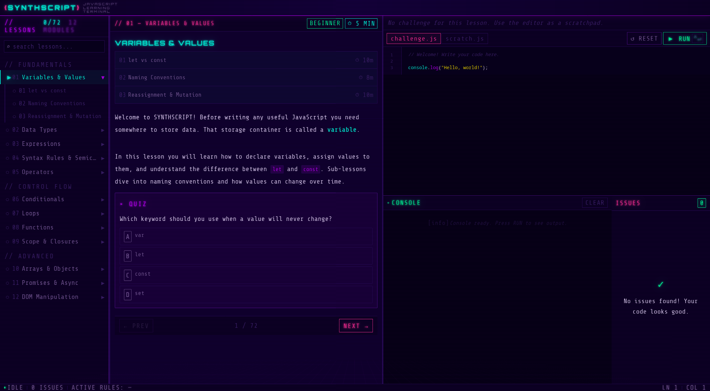
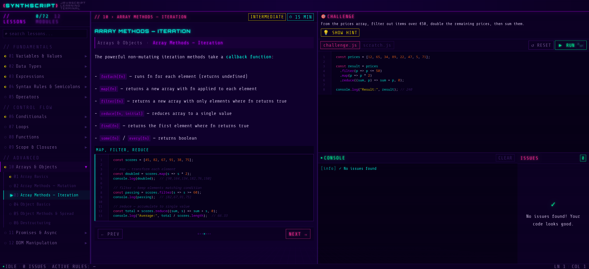
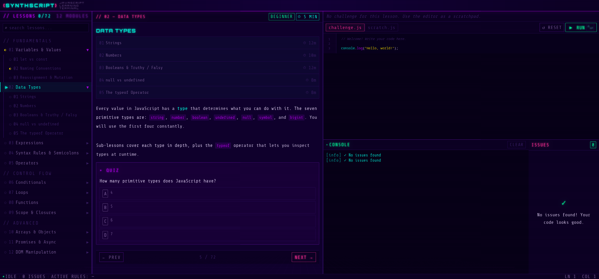
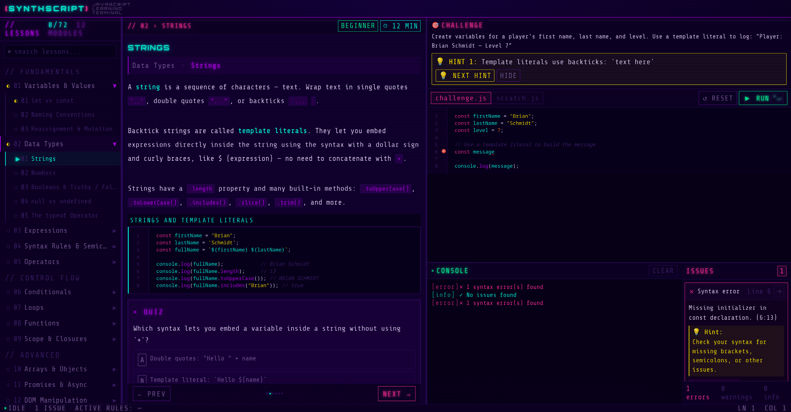

# 🌆 SYNTHSCRIPT

### Learn JavaScript in a Retro-Futuristic Terminal Like Environment

[](https://reactjs.org/)
[](https://www.typescriptlang.org/)
[](https://vitejs.dev/)
[](https://nodejs.org/)
[](LICENSE)

_Immerse yourself in a synthwave-inspired coding experience while mastering JavaScript fundamentals_

</div>

---

## 📖 About

**SYNTHSCRIPT** is an interactive JavaScript learning platform that transports you to a neon-drenched retro-futuristic terminal. Learn programming concepts through hands-on challenges, real-time code execution, and instant feedback — all wrapped in a stunning synthwave aesthetic.

Whether you're a complete beginner or looking to reinforce your JavaScript knowledge, SYNTHSCRIPT provides an engaging environment to master variables, functions, arrays, objects, and more through:

- 🎮 **Interactive Lessons** — Learn by doing with code challenges and quizzes
- ⚡ **Real-time Execution** — Run your code instantly and see results in the built-in console
- 🎯 **Instant Feedback** — Get immediate validation and helpful hints when you're stuck
- 📱 **Responsive Design** — Learn on desktop or mobile with a seamless experience
- 🌙 **Immersive Theme** — Stay focused with a beautiful dark synthwave interface

---

## 🚀 Features

### 💻 Interactive Code Editor

- Syntax highlighting powered by CodeMirror
- Real-time linting and error detection
- Keyboard shortcuts for power users
- Auto-indentation and bracket matching

### 📚 Structured Learning Path

- **Progressive Curriculum** — Start with basics and advance to complex concepts
- **Sub-lessons** — Deep dive into specific topics with focused exercises
- **Code Examples** — See working code before attempting challenges
- **Quizzes** — Test your understanding with interactive questions

### 🎨 Synthwave Terminal Interface

- Neon color palette with retro-futuristic vibes
- Resizable panel layout for optimal workspace
- Mobile-responsive design with tab navigation
- Smooth animations and transitions

### 🔧 Smart Code Execution

- Secure sandboxed environment for running JavaScript
- Console output with error highlighting
- Rate-limited execution for fair usage
- Support for console.log and standard JS APIs

### 📊 Progress Tracking

- Visual progress indicators for each lesson
- Navigation breadcrumbs showing your position
- Mark lessons as completed as you progress
- Difficulty ratings and time estimates

---

## 🎬 Screenshots

### Main Learning Interface



### Code Editor in Action



### Lesson Navigation



### Error and Hint Highlighting



---

## 🛠️ Tech Stack

### Frontend

- **React 19** — Modern React with concurrent features
- **TypeScript** — Type-safe development
- **Vite** — Lightning-fast build tool and dev server
- **CodeMirror** — Powerful code editor component
- **Zustand** — Lightweight state management
- **React Resizable Panels** — Flexible layout system

### Backend

- **Node.js** — JavaScript runtime
- **Express** — Web framework
- **BullMQ** — Job queue for code execution
- **Redis** — Queue storage (optional)
- **WebSocket** — Real-time communication

### Development Tools

- **ESLint** — Code linting
- **Vitest** — Unit testing
- **TypeScript ESLint** — Type-aware linting
- **Prettier** — Code formatting (recommended)

---

## 📦 Installation

### Prerequisites

- Node.js 18+ and npm
- Git (for cloning)

### Clone the Repository

```bash
git clone https://github.com/web-dev-codi/javascript-learning-terminal.git
cd javascript-learning-terminal
```

### Install Dependencies

```bash
# Install frontend dependencies
npm install

# Install backend dependencies
cd backend
npm install
cd ..
```

### Environment Setup

Create a `.env` file in the `backend` directory (optional, for Redis):

```env
REDIS_URL=redis://localhost:6379
PORT=3001
```

---

## 🎮 Usage

### Development Mode

Run both frontend and backend concurrently:

```bash
npm run dev
```

This starts:

- Frontend: <http://localhost:5173>
- Backend: <http://localhost:3001>

### Run Frontend Only

```bash
npm run dev:frontend
```

### Run Backend Only

```bash
npm run dev:backend
```

### Production Build

```bash
npm run build
npm run preview
```

---

## 📚 Curriculum Overview

### Fundamentals

1. **Variables & Values** — `let`, `const`, naming conventions
2. **Data Types** — Strings, numbers, booleans, null, undefined
3. **Operators** — Arithmetic, comparison, logical operators
4. **Conditionals** — `if/else`, ternary, switch statements

### Control Flow

1. **Loops** — `for`, `while`, `forEach`, `for...of`
2. **Functions** — Declaration, expression, arrow functions
3. **Scope** — Block scope, function scope, closures

### Data Structures

1. **Arrays** — Methods, manipulation, iteration
2. **Objects** — Properties, methods, destructuring
3. **Advanced Types** — Template literals, type coercion

---

## 🗺️ Roadmap

- [ ] Add more advanced lessons (async/await, classes, modules)
- [ ] Implement user authentication and progress persistence
- [ ] Add achievement system and badges
- [ ] Create collaborative coding challenges
- [ ] Support for additional languages (Python, TypeScript)
- [ ] Desktop application (Electron)
- [ ] Dark/light theme toggle
- [ ] Custom keyboard shortcuts
- [ ] Export code snippets
- [ ] Integration with popular IDEs

---

## 🤝 Contributing

Contributions are what make the open-source community such an amazing place to learn, inspire, and create. Any contributions you make are **greatly appreciated**.

1. Fork the Project
2. Create your Feature Branch (`git checkout -b feature/AmazingFeature`)
3. Commit your Changes (`git commit -m 'Add some AmazingFeature'`)
4. Push to the Branch (`git push origin feature/AmazingFeature`)
5. Open a Pull Request

See `CONTRIBUTING.md` for more details.

---

## 📝 License

Distributed under the MIT License. See `LICENSE` for more information.

---

## 🙏 Acknowledgments

- **React Team** — For the amazing React framework
- **CodeMirror** — For the excellent code editor component
- **Vite** — For the blazing-fast build tool
- **Synthwave Aesthetic** — Inspired by retro-futuristic design and 80s culture

---

## 📧 Contact

Web Dev Codi — [@webdevcodi](https://twitter.com/webdevcodi) — <webdevcodi@gmail.com>

Project Link: [https://github.com/web-dev-codi/javascript-learning-terminal](https://github.com/web-dev-codi/javascript-learning-terminal)

---

<div align="center">

**Made with 💜 and ☕ in the synthwave era**

[⬆ Back to Top](#-synthscript)

</div>
